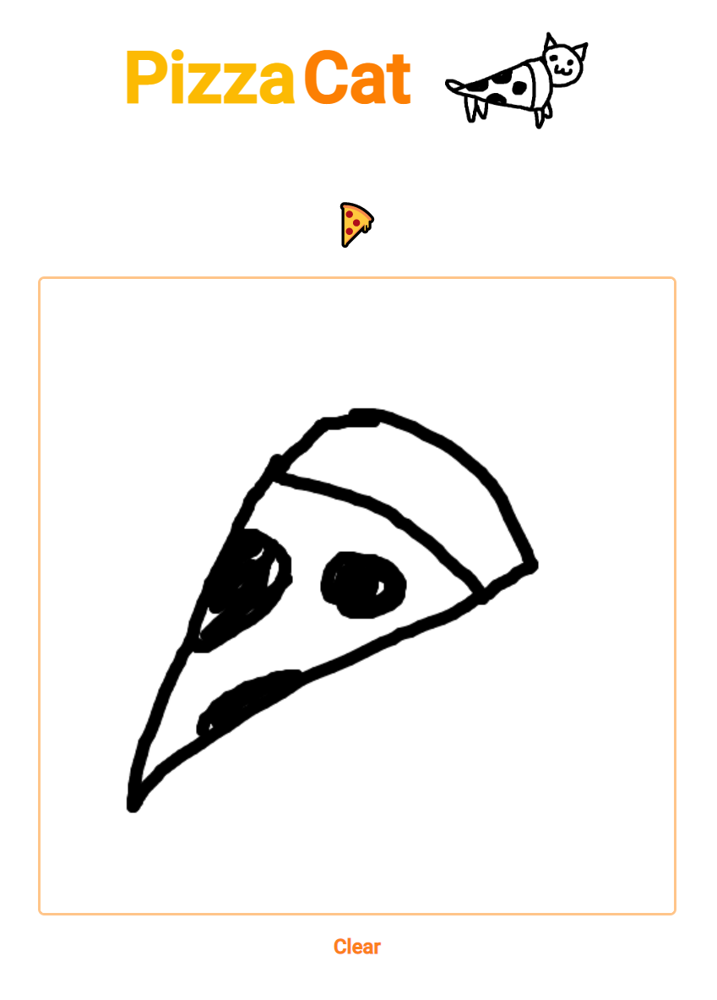

# PizzaCat
Image classifier program that determines whether you are drawing a Pizza or a Cat.

## Demonstration

<div style="
  display: flex;
  flex-direction: row;
  justify-content: center;
  align-items: center;
">
  </img>
  </img>
</div>

## Info
This was created using a multitude of resources. In order to train the model Google QuickDraw's dataset was used; a dataset that offers millions of drawings of many different objects. The model used to classify the drawings was scikitlearn's ```RandomForestClassifier```. Each class was trained with 5000 different images which feature drawings of pizza and cats. The model was tested on 2500 images and showed to be 92% accurate.

In order to find the perfect model there many trials using many different models and the current model used proved to be the most successful.

The original plan of this project was to offer classification of 15 different classes but this was reduced to only 2 due to unsuccessful trials. Interesting things I found was that increasing the number of drawings in the training set seemed to reduce the accuracy after a certain number so 5000 seemed to be sufficent.

Note: The model used for testing could not be uploaded to this repository due to its large size.

## Run It Yourself

Build model using ```Quickdraw Model Builder```.

Download Flask:
```
pip install flask
```

Run ```flask run``` in ```.\PizzaCat```

